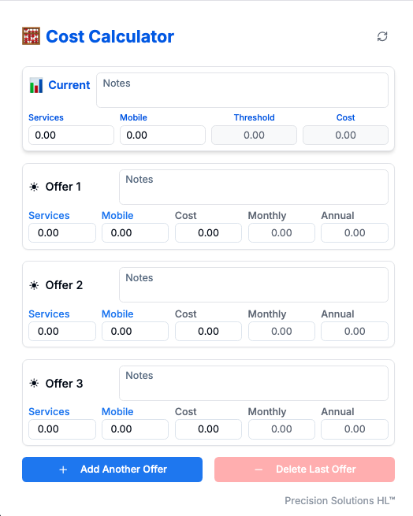

# Telecom Cost Calculator

A modern web application designed to help calculate and compare telecom service costs and potential savings. Built with Next.js and React, featuring a clean, user-friendly interface and real-time calculations.



## 🚀 Features

- **Current Cost Analysis**: Input and track current service and mobile costs
- **Multiple Offer Comparison**: Compare up to multiple different service offers simultaneously
- **Real-time Calculations**: 
  - Monthly and annual savings calculations
  - Automatic threshold calculations (80% of current services)
  - Total household cost analysis
- **Smart Offer Management**:
  - Add/remove offer comparisons dynamically
  - Best offer highlighting
  - Detailed notes for each offer
- **Responsive Design**: Works seamlessly on desktop and mobile devices
- **Analytics Integration**: Track usage patterns and user interactions

## 🛠️ Tech Stack

- **Framework**: Next.js 14
- **UI**: React with Tailwind CSS
- **Analytics**: Vercel Analytics
- **Styling**: Tailwind CSS with custom components
- **Deployment**: Vercel

## 📦 Installation

1. Clone the repository:
   ```bash
   git clone https://github.com/yourusername/telecomcostcalculator.git
   cd telecomcostcalculator
   ```

2. Install dependencies:
   ```bash
   npm install
   # or
   yarn install
   ```

3. Run the development server:
   ```bash
   npm run dev
   # or
   yarn dev
   ```

4. Open [http://localhost:3000](http://localhost:3000) in your browser

## 💻 Usage

1. **Enter Current Costs**:
   - Input your current services cost
   - Add current mobile costs (if applicable)
   - Add any relevant notes

2. **Compare Offers**:
   - Enter service costs for each offer
   - Add mobile costs if included
   - Add notes for offer details
   - The best offer will be automatically highlighted

3. **Analyze Results**:
   - View monthly and annual savings for each offer
   - Compare total household costs
   - Use the threshold value as a negotiation target

4. **Manage Offers**:
   - Add more offers as needed
   - Remove unnecessary offers
   - Reset calculator for new comparisons

## 🤝 Contributing

Contributions, issues, and feature requests are welcome! Feel free to check the [issues page](https://github.com/yourusername/telecomcostcalculator/issues).

## 📝 License

This project is [MIT](LICENSE) licensed.

## 👥 Contact

For questions or feedback, please reach out through GitHub issues.
